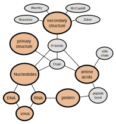

---------------------------------

In order to better understand the underlying biological concepts of this lecture, read the E-learning
material for [Biological basics]() and [RNA secondary structure](). Please review the material beforehand.
We will solve the exercise question together within the exercise session.

---------------------------------

# Exercise 1 - Biological Basics

::: {.question data-latex=""}

Create an individual mind map for the learning unit on [biological basics](). (A mind map is a graph
with nodes for terms and edges that describe a logical relationship between terms, e.g. an organism
consists of cell(s) so you could draw a line between the terms organism and cell, the line could then
be annotated with ‘contains’ to denote the logical relationship).

Try to identify important keywords and connect them with edges describing their logical relation-
ship. The mind map should consist of at least 10 nodes. There will be many different possible and
equally valid solutions.

:::


#### {.tabset}

##### Hide

##### Solution

::: {.answer data-latex=""}

There are many possible solutions. Here is one example:

```{r, include=knitr::is_html_output(), echo=FALSE, fig.align='center', out.width='80%'}

```

:::

#### {-}

---------------------------------

# Exercise 2 - RNA secondary structure

::: {.question data-latex=""}

Given the following (unordered) initial set of keywords, arrange them in a mind map with respective
relations. Extend with all keywords and relations you find missing and important, given the learning
unit on [RNA secondary structure]().

- multi loop
- Feynman diagram
- nucleotide
- primary structure
- crossing
- stacking
- Guanine
- Watson-Crick base pair
- helix

:::

#### {.tabset}

##### Hide

##### Solution

::: {.answer data-latex=""}

There are many possible solutions. Here is one example:

```{r, include=knitr::is_html_output(), echo=FALSE, fig.align='center', out.width='100%'}
knitr::include_graphics("assets/figures/exercise-sheet-0/e2-1.svg")
```

:::

#### {-}

---------------------------------

# Exercise 3


::: {.question data-latex=""}

How much of the DNA is transcribed and then translated into protein and how much of the DNA
is transcribed into RNA in humans?

:::

#### {.tabset}

##### Hide

##### Solution

::: {.answer data-latex=""}

- 1% DNA -to- protein
- 80 - 90% DNA -to- RNA

:::

#### {-}

-------------------------------------------
