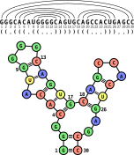

---------------------------------

# Exercise 1

Consider the RNA with sequence:

```
S = GGGCACAUGGGGCAGUGCAGCCACUGAGCC
```

$P = \{(1,30),(2,29),(4,17),(5,16),(6,15),(8,14),(9,13),(18,26),(19,25),(20,24)\}$

---------------------------------

### 1.1

::: {.question data-latex=""}

Draw the structure in dot-bracket notation and as a graphical representation.

:::

#### {.tabset}

##### Hide

##### Solution

::: {.answer data-latex=""}

```{r, include=knitr::is_html_output(), echo=FALSE,}

```

:::

#### {-}

---------------------------------

### 1.2

::: {.question data-latex=""}

Consider the structure $P'=P\cup\{(11,22),(12,21)\}$ of sequence S.

Modify your drawings, where possible, in order to show the new structure $P'$. Where does
this fail and why?

:::

#### {.tabset}

##### Hide

##### Solution

::: {.answer data-latex=""}
Problem: pseudoknot

```{r, include=knitr::is_html_output(), echo=FALSE,}
knitr::include_graphics("assets/figures/exercise-sheet-1/graph_represention_part2.svg")
```

The new base pairs/arcs $(11, 22)$ and $(12, 21)$ result in a pseudoknot.
The bracket-only dot-bracket notation can not display pseudoknots.
One would need to introduce a different symbol eg using square brackets `[] to indicate the opening and closing positions of the crossing base pairs.
:::

#### {-}

---------------------------------

# Exercise 2

For a variation of Nussinov algorithm with minimum loop length $1$, consider the following computed Nussinov matrix $N$ for the sequence `AUCACCGC`:

```{r, include=knitr::is_html_output(), echo=FALSE, fig.align='center', out.width='50%'}

```

---------------------------------

### 2.1

::: {.question data-latex=""}

Compute the optimal structure according to the following recursion (considering loop length 1)!

```{r, include=knitr::is_html_output(), echo=FALSE,}

```

:::

#### {.tabset}

##### Hide

##### Solution

::: {.answer data-latex=""}
P = \{(5,7),(2,4)\}
:::

#### {-}

---------------------------------

### 2.2

::: {.question data-latex=""}

Is there more than one optimal structure?

:::

#### {.tabset}

##### Hide

##### Solution

::: {.answer data-latex=""}

No, there is just one optimal structure $P = \{(2,4),(5,7)\}$ when considering loop length 1.

Apart from the pairs $(5,7)$ and $(2,4)$, only positions $(2,7)$ and $(3,7)$ are possible, which only are present in structures that have just one base pair and are therefore not optimal.

:::

#### {-}

---------------------------------

### 2.3

::: {.question data-latex=""}

Define all optimal tracebacks! Is there more than one optimal traceback?

:::

#### {.tabset}

##### Hide

##### Solution

::: {.answer data-latex=""}

There are 5 possible tracebacks (for the same optimal structure):

a.
    * $N_{1,8} \rightarrow N_{1,1}+N_{2,8}$
    * $N_{1,1} \rightarrow $ STOP
    * $N_{2,8} \rightarrow N_{2,4}+N_{5,8}$
    * $N_{2,4} \rightarrow N_{3,3}+bp (2,4)$
    * $N_{3,3} \rightarrow $ STOP
    * $N_{5,8} \rightarrow N_{5,7}+N_{8,8}$
    * $N_{5,7} \rightarrow N_{6,6}+bp (5,7)$
    * $N_{6,6} \rightarrow $ STOP
    * $N_{8,8} \rightarrow $ STOP
b.
    * $N_{1,8} \rightarrow N_{1,1}+N_{2,8}$
    * $N_{1,1} \rightarrow $ STOP
    * $N_{2,8} \rightarrow N_{2,7}+N_{8,8}$
    * $N_{2,7} \rightarrow N_{2,4}+N_{5,7}$
    * $N_{2,4} \rightarrow N_{3,3}+bp (2,4)$
    * $N_{3,3} \rightarrow $ STOP
    * $N_{5,7} \rightarrow N_{6,6}+bp (5,7)$
    * $N_{6,6} \rightarrow $ STOP
    * $N_{8,8} \rightarrow $ STOP
c.
    * $N_{1,8} \rightarrow N_{1,4}+N_{5,8}$
    * $N_{1,4} \rightarrow N_{1,1}+N_{2,4}$
    * $N_{1,1} \rightarrow $ STOP
    * $N_{2,4} \rightarrow N_{3,3}+bp (2,4)$
    * $N_{3,3} \rightarrow $ STOP
    * $N_{5,8} \rightarrow N_{5,7}+N_{8,8}$
    * $N_{5,7} \rightarrow N_{6,6}+bp (5,7)$
    * $N_{6,6} \rightarrow $ STOP
    * $N_{8,8} \rightarrow $ STOP
d.
    * $N_{1,8} \rightarrow N_{1,7}+N_{8,8}$
    * $N_{1,7} \rightarrow N_{1,1}+N_{2,7}$
    * $N_{1,1} \rightarrow $ STOP
    * $N_{2,7} \rightarrow N_{2,4}+N_{5,7}$
    * $N_{2,4} \rightarrow N_{3,3}+bp (2,4)$
    * $N_{3,3} \rightarrow $ STOP
    * $N_{5,7} \rightarrow N_{6,6}+bp (5,7)$
    * $N_{6,6} \rightarrow $ STOP
    * $N_{8,8} \rightarrow $ STOP
e.
    * $N_{1,8} \rightarrow N_{1,7}+N_{8,8}$
    * $N_{1,7} \rightarrow N_{1,4}+N_{5,7}$
    * $N_{1,4} \rightarrow N_{1,1}+N_{2,4}$
    * $N_{1,1} \rightarrow $ STOP
    * $N_{2,4} \rightarrow N_{3,3}+bp (2,4)$
    * $N_{3,3} \rightarrow $ STOP
    * $N_{5,7} \rightarrow N_{6,6}+bp (5,7)$
    * $N_{6,6} \rightarrow $ STOP
    * $N_{8,8} \rightarrow $ STOP

:::

#### {-}

---------------------------------

### 2.4

::: {.question data-latex=""}

Does the last answer still hold for the following recursion (considering loop length 1)? Identify the possible traceback(s)!

```{r, include=knitr::is_html_output(), echo=FALSE,}
knitr::include_graphics("assets/figures/exercise-sheet-1/nussinov-recursion-ambiguous.png")
```

:::

#### {.tabset}

##### Hide

##### Solution

::: {.answer data-latex=""}

No, because the original Nussinov is not ambiguous.

Only if a base pair is found the sequence is separated into two parts for the further recursion.
In the first recursion, the sequence is always split unless there is a possible base pair. This generates several possible tracebacks for the same optimal sequence.

a.
    * $N_{1,8} \rightarrow N_{1,7}$
    * $N_{1,7} \rightarrow N_{1,4}+N_{6,6}+ bp(5,7)$
    * $N_{1,4} \rightarrow N_{1,1}+N_{3,3}+ bp(2,4)$
    * $N_{1,1} \rightarrow $ STOP
    * $N_{3,3} \rightarrow $ STOP
    * $N_{6,6} \rightarrow $ STOP
:::

#### {-}


<script src="assets/js/scripts.js"></script>
