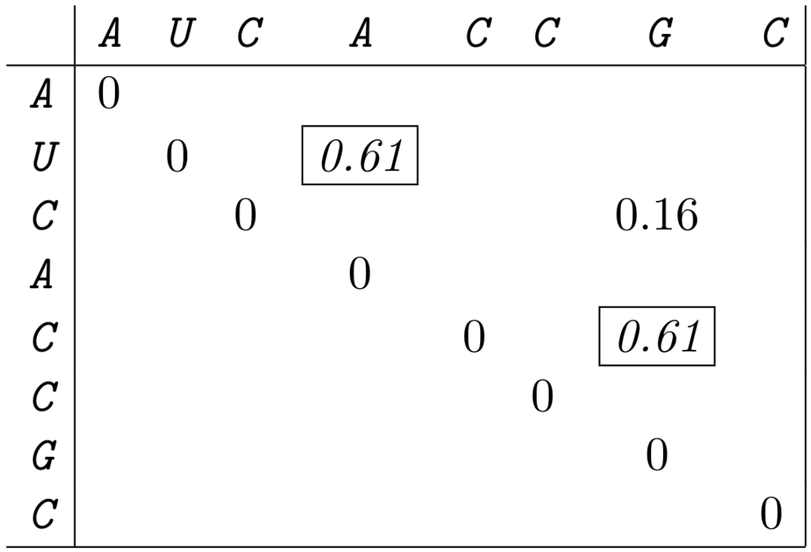

```{r, include=FALSE}
source("assets/custom_functions.R")
library(flextable)
library(officer)
```

---------------------------------

# Exercise 1 - entropy

---------------------------------

We want to have a short look at the concept of entropy.
Let $X$ be a discrete random variable with probabilities $p(i), (i=1,2,\ldots,n)$.
The amount of information to be associated with an outcome of probability $p(i)$
is defined as $I(p(i)) = \log_2(\frac{1}{p(i)})$.

In information theory, the expected value of the information $I(X)$ for the random variable $X$ is called entropy.
The entropy is given by

$$H(X) = E[I(X)] = \sum_{i=1}^{n}p(i)\log_2(\frac{1}{p(i)}).$$

Note that all logarithms in this exercise are base 2 (standard in information theory).

---------------------------------

### 1.1

::: {.question data-latex=""}

Compute the entropy of the probability distribution $p(1) = \frac{1}{2},\, p(2) = \frac{1}{4},\, p(3) = \frac{1}{8},\, p(4) = \frac{1}{8}$.

:::

#### {.tabset}

##### Hide

##### Solution

::: {.answer data-latex=""}

\[
\begin{align*}
H(X) & = p(1)\log\left(\frac{1}{p(1)}\right) + p(2)\log\left(\frac{1}{p(2)}\right) + p(3)\log\left(\frac{1}{p(3)}\right) + p(4)\log\left(\frac{1}{p(4)}\right)\\
& = \frac{1}{2} + \frac{2}{4} + \frac{3}{8} + \frac{3}{8}\\
& = \frac{14}{8}
\end{align*}
\]

:::

#### {-}

---------------------------------

### 1.2

::: {.question data-latex=""}

Compute the entropy of the distribution $p(i) = \frac{1}{4},\: (i= 1,2,3,4)$.

:::

#### {.tabset}

##### Hide

##### Solution

::: {.answer data-latex=""}

\[
\begin{align*}
H(X) & = & 4 \cdot p(i) \log(\frac{1}{p(i)})\\
& = & 2
\end{align*}
\]

:::

#### {-}

---------------------------------

### 1.3

::: {.question data-latex=""}

How can you explain the difference in entropy for both probability distributions?

:::

#### {.tabset}

##### Hide

##### Solution

::: {.answer data-latex=""}

For the probability distribution in part 1. the information content of the probability distribution is higher than for 2. as we get more information from the distribution itself (e.g. we know that we are more likely to observe i=1).\\
The information content for the event is higher for part 2. as we can learn more from the event (see coin example from the lecture).

This results in a higher entropy for the probability distribution in part 2..
:::

#### {-}

---------------------------------

# Exercise 2 - true or false ?

---------------------------------

Consider some sequence $S$ with a set of possible structures
$\cal{P}$ and partition function $Z$. Furthermore, let for each
structure $P\in\mathcal{P}$ denote that $Pr[P]$ is the probability that $S$ forms
structure $P$.

Which of the following statements are true?

::: {.question data-latex=""}

- [ ] &nbsp; $Z$ is the maximum of the Boltzmann weights of all structures $P\in\mathcal{P}$ of $S$.
- [ ] &nbsp; $Z$ is the average of the Boltzmann weights of all structures $P\in\mathcal{P}$ of $S$.
- [ ] &nbsp; $Z$ is the sum of the Boltzmann weights of all structures $P\in\mathcal{P}$ of $S$.
- [ ] &nbsp; $Z$ is the minimum of the Boltzmann weights of all structures $P\in\mathcal{P}$ of $S$.
- [ ] &nbsp; The sum of the Boltzmann weights of all structures $P\in\mathcal{P}$ is one.
- [ ] &nbsp; The sum of the probabilities $Pr[P]$ of all structures $P\in\mathcal{P}$ is one.
- [ ] &nbsp; The Boltzmann weight of a structures $P\in\mathcal{P}$ depends on the temperature.
- [ ] &nbsp; The probability $Pr[P]$ of a structures $P\in\mathcal{P}$ depends on the temperature.
- [ ] &nbsp; The Boltzmann weight of the MFE structure of $S$ is the maximum among the Boltzmann weights of all structures $P\in\mathcal{P}$.

:::

#### {.tabset}

##### Hide

##### Solution

::: {.answer data-latex=""}

- [ ] &nbsp; $Z$ is the maximum of the Boltzmann weights of all structures $P\in\mathcal{P}$ of $S$.
- [ ] &nbsp; $Z$ is the average of the Boltzmann weights of all structures $P\in\mathcal{P}$ of $S$.
- [x] &nbsp; $Z$ is the sum of the Boltzmann weights of all structures $P\in\mathcal{P}$ of $S$.
- [ ] &nbsp; $Z$ is the minimum of the Boltzmann weights of all structures $P\in\mathcal{P}$ of $S$.
- [ ] &nbsp; The sum of the Boltzmann weights of all structures $P\in\mathcal{P}$ is one.
- [x] &nbsp; The sum of the probabilities $Pr[P]$ of all structures $P\in\mathcal{P}$ is one.
- [x] &nbsp; The Boltzmann weight of a structures $P\in\mathcal{P}$ depends on the temperature.
- [x] &nbsp; The probability $Pr[P]$ of a structures $P\in\mathcal{P}$ depends on the temperature.
$$
 Pr[P \mid T] = \frac{\exp(-E(P)/RT)}{\sum_{P'}\exp(-E(P)/RT)}
 \neq
 \frac{\exp(-E(P)/R(T+\Delta))}{\sum_{P'}\exp(-E(P)/R(T+\Delta))} =
 Pr[P\mid T+\Delta]
$$
- [x] &nbsp; The Boltzmann weight of the MFE structure of $S$ is the maximum among the Boltzmann weights of all structures $P\in\mathcal{P}$.

:::

#### {-}

---------------------------------

# Exercise 3 - partition function

---------------------------------

Given the RNA sequence `AUCACCGC` and a minimal loop length of $1$.
Compute the partition function of the molecule using an energy function similar to the Nussinov algorithm:
$$
	E(P) = |P|
$$
that is the energy is the number of non-crossing base pairs of a given structure
(only GC and AU pairs are to be considered).

Table of Boltzmann weights for $RT = 1$:

```{r, results="asis", include=knitr::is_html_output(), echo=FALSE}
sij <- read.csv("assets/tables/exercise-sheet-3/boltzmann-weights.csv", check.names=FALSE, sep=";")
sij_ft <- flextable(sij)
sij_ft <- custom_theme(sij_ft)
index_replace(sij_ft)
```

---------------------------------

### 3.1

::: {.question data-latex=""}

Compute $Z$ via exhaustive structure space enumeration. (using the provided Boltzmann weights)

:::

#### {.tabset}

##### Hide

##### Solution

::: {.answer data-latex=""}

```{r, results="asis", include=knitr::is_html_output(), echo=FALSE}
sij <- read.csv("assets/tables/exercise-sheet-3/e3-1.csv", check.names=FALSE, sep=";")
sij_ft <- flextable(sij)
sij_ft <- custom_theme(sij_ft)
index_replace(sij_ft)
```

:::

#### {-}

---------------------------------

### 3.2

::: {.question data-latex=""}

Compute the structure probability of all structures.

:::

#### {.tabset}

##### Hide

##### Solution

::: {.answer data-latex=""}

```{r, results="asis", include=knitr::is_html_output(), echo=FALSE}
sij <- read.csv("assets/tables/exercise-sheet-3/e3-2.csv", check.names=FALSE, sep=";")
sij_ft <- flextable(sij)
sij_ft <- custom_theme(sij_ft)
index_replace(sij_ft)
```

:::

#### {-}

---------------------------------

### 3.3

::: {.question data-latex=""}

Compare the structure probabilities in relation to each other? What is the structure probability of the open chain? What can you observe?

:::

#### {.tabset}

##### Hide

##### Solution

::: {.answer data-latex=""}

The open chain is more likely than any other structure including the optimal structure (here $P=\{(2,4)(5,7)\}$).

:::

#### {-}

---------------------------------

### 3.4

::: {.question data-latex=""}

Is this result expected?

:::

#### {.tabset}

##### Hide

##### Solution

::: {.answer data-latex=""}

This is not expected, the open chain should not have a higher probability than the optimal structure.

:::

#### {-}

---------------------------------

### 3.5

::: {.question data-latex=""}

If not how can you fix it? Test your idea by recalculating the structure probabilities!

:::

#### {.tabset}

##### Hide

##### Solution

::: {.answer data-latex=""}

The solution is to negate the energy function, i.e. $E(P) = -|P|$

```{r, results="asis", include=knitr::is_html_output(), echo=FALSE}
sij <- read.csv("assets/tables/exercise-sheet-3/e3-3.csv", check.names=FALSE, sep=";")
sij_ft <- flextable(sij)
sij_ft <- custom_theme(sij_ft)
index_replace(sij_ft)
```

We can now search for the optimal structure by energy minimization and the mfe structure is the most probable structure, as expected.
:::

#### {-}

---------------------------------

# Exercise 4 - Base pair and unpaired probabilities

---------------------------------

Given the corrected probabilities of the previous exercise for sequence `AUCACCGC`.

---------------------------------

### 4.1

::: {.question data-latex=""}

Compute and visualize the base pair probabilities in a dot-plot using your corrected energy function. (use the probability values instead of dots.)

:::

#### {.tabset}

##### Hide

##### Solution

::: {.answer data-latex=""}

```{r, include=knitr::is_html_output(), echo=FALSE,}

```

:::

#### {-}

---------------------------------

### 4.2

::: {.question data-latex=""}

Compute the probability $P^u(4)$ and $P^u(5)$ to be unpaired at sequence position 4 and 5, resp., and $P^u(4,5)$ that the subsequence $4..5$ is not involved in any base pairing.

:::

#### {.tabset}

##### Hide

##### Solution

::: {.answer data-latex=""}

$$
P^u(4) &= 0.06 + 0.16 + 0.16 = 0.38\\
P^u(5) &= 0.06 + 0.16 + 0.16 = 0.38\\
P^u(4,5) &= 0.06 + 0.16 = 0.22
$$

:::

#### {-}

---------------------------------

### 4.3

::: {.question data-latex=""}

Why can't we compute $P^u(4,5)$ from $P^u(4)$ and $P^u(5)$ using their product, i.e. why is $P^u(4,5) \neq P^u(4)\cdot P^u(5)$?

:::

#### {.tabset}

##### Hide

##### Solution

::: {.answer data-latex=""}

The set of structures considered for $P^u(4,5)$ is a subset of both structure sets used to compute $P^u(4)$ and $P^u(5)$.
Thus, the two probabilities are not independent and can not be multiplied.

:::

#### {-}

---------------------------------

<script src="assets/js/scripts.js"></script>
