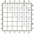
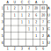

---------------------------------

# Exercise 1

<!--- --------------------------------- -->

::: {.question data-latex=""}

You are given the following matrix $C$ for sequence $S$ = `AUCCAU`:

```{r, include=knitr::is_html_output(), echo=FALSE,  fig.align='center', out.width='50%'}

```

It was calculated using the following recursion:

$$
C_{i,j} = \textbf{1}(i,j) \cdot C_{i+1,j-1} * 1 + \sum_{i\leq k < j} C_{i,k} * C_{k+1,j}, with \textbf{1}(i,j) = \begin{cases} 1 & \text{if } S_{i} S_{j} \text{compl.} \\ 0 & \text{else} \end{cases}
$$

:::

<!--- --------------------------------- -->

### 1.1

::: {.question data-latex=""}

Calculate the value of $C_{1,6}$. What does it represent?

:::

#### {.tabset}

##### Hide

##### Solution

::: {.answer data-latex=""}

$C_{1,6}$ is the number of possible secondary structures for the sequence $S$.

```{r, include=knitr::is_html_output(), echo=FALSE,  fig.align='center', out.width='50%'}

```

:::

<!--- --------------------------------- -->

### 1.2

::: {.question data-latex=""}

Does this result make sense? Justify your answer!

:::

#### {.tabset}

##### Hide

##### Solution

::: {.answer data-latex=""}

No, this result does not make sense. The number of possible secondary structures for the sequence $S$ is much lower than 83.
Several structures are counted multiple times.

:::

<!--- --------------------------------- -->

### 1.3

::: {.question data-latex=""}

Recalculate the matrix $C$ using the following recursion:

$$
C_{i,j} = C_{i,j-1} + \sum\limit_{\substack{i \leq k < j \\ S_{k}, S_{j} \text{compl.}}} C_{i,k-1} * C_{k+1,j-1}
$$

```{r, include=knitr::is_html_output(), echo=FALSE,  fig.align='center', out.width='50%'}
knitr::include_graphics("assets/figures/exercise-sheet-4/e2-1.svg")
```

:::

#### {.tabset}

##### Hide

##### Solution

::: {.answer data-latex=""}

```{r, include=knitr::is_html_output(), echo=FALSE,  fig.align='center', out.width='50%'}
knitr::include_graphics("assets/figures/exercise-sheet-4/e2-1_sol.svg")
```

:::

<!--- --------------------------------- -->

### 1.4

::: {.question data-latex=""}

Why does the result of this recursion differ from the result of the first recursion?

:::

#### {.tabset}

##### Hide

##### Solution

::: {.answer data-latex=""}

There is no ambiguity, the first part of the recursion only counts cases where $j$ is unpaired and the second part only counts cases where $j$ is paired. Both parts of the recursion are disjoint. Whereas the recursion from exercise 1.1 is ambiguous in the second part of the recursion.

:::


