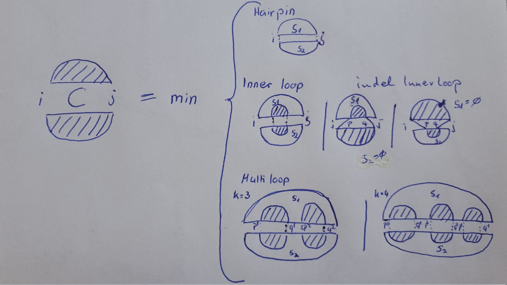
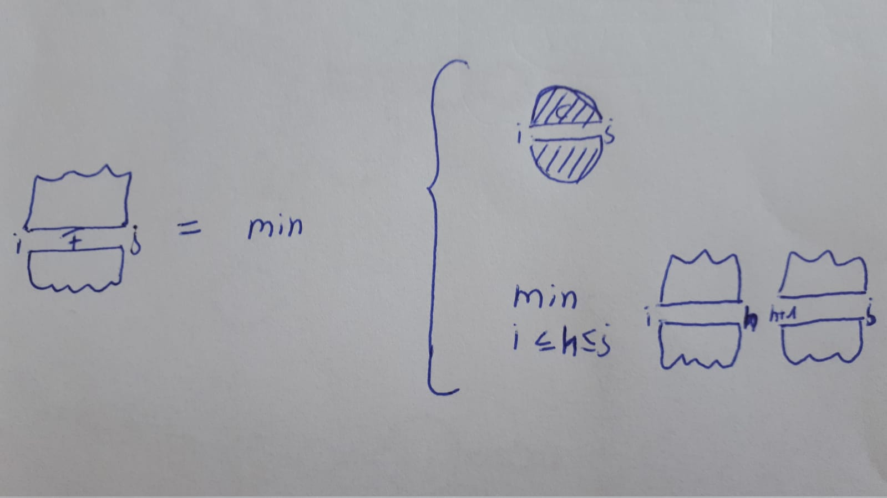

---------------------------------

# Exercise 1

<!--- --------------------------------- -->

::: {.question data-latex=""}

The Sankoff algorithm is obtained from the Zuker recursions by raising them from folding one sub-sequence to folding two sub-sequences.
Furthermore, it adds the edit distance.
Develop asimpler version of Sankoff that is obtained by starting the same construction from the simpler, but less efficient, form of the Zuker recursions

$$
C(i,j) = \min_{1 \leq k \leq 4} \left( \min_{s \text{ is a $k$-loop closed by } (i,j)} \left\{ e(s) + \sum_{(p,q) \text{ accessible in $s$ from } (i,j)} C(p,q) \right\} \right)
$$

with the initial conditions $C(i,i) = \infty$, and

$$
F(i,j) = \min_{ C(i,j), min_{i \leq h < j} \left[ F(i,h) + F(h+1,j) \right]}
$$

with the initial conditions $F(i,i) = 0$.

Furthermore, you can neglect the edit distance contribution.
Make sure that your algorithm still has the same structural restrictions as the Sankoff algorithm,
i.e. each hairpin is aligned to a hairpin,
each multiloop is aligned to a corresponding multiloop and each 2-loop (including stackings and bulges) is aligned to at most one other 2-loop.

:::

<!--- --------------------------------- -->

### 1.1

::: {.question data-latex=""}

Generate respective recursion depictions for the translation of $C$ and $F$ into a Sankoff-style algorithm.

:::

#### {.tabset}

##### Hide

##### Solution

::: {.answer data-latex=""}

Decomposition into hairpin and interior case analogously to original Sankoff plus two explicit multi-loop cases for $k=3$ and $k=4$.

$$
  C(i_{1},j_{1},i_{2},j_{2}) = \min
  \begin{cases}
    e(s_{1}) + e(s_{2}); & \text{where \(s_{1}, s_{2}\) are hairpin closing base pairs} (i_{1}, j_{1})(i_{2},j_{2}) \\
    \min_{p_{1},q_{1},p_{2},q_{2}} \{e(s_{1}) + e(s_{2}) + C(p_{1},q_{1},p_{2},q_{2})\}; & \\
    \min_{k > 2} \{e(s_{1}) + e(s_{2}) + \sum_{l=1}^{k-1} C(p_{1}^{l},q_{1}^{l},p_{2}^{l},q_{2}^{l})\} & \\
  \end{cases}
$$

$$
\text{where in the second case, \( s_{1}, s_{2} \) are 2-loops enclosed by \( i_{1},j_{1},i_{2},j_{2} \) with \( pq \) accessible.}
$$


```{r, include=knitr::is_html_output(), echo=FALSE,  fig.align='center', out.width='50%'}

```

$$
  F(i_{1},j_{1},i_{2},j_{2}) = \min
  \begin{cases}
    C(i_{1},j_{1};i_{2},j_{2})\\
    min_{\substack{i_{1}\leq h_{1} \leq j_{1} \\ i_{2}\leq h_{2} \leq j_{2}}} \{F(i_{1},h_{1}; i_{2},h_{2}) +  F(h_{1}+1, j_{1}; h_{2}+1, j_{2})\}\\
  \end{cases}
$$

```{r, include=knitr::is_html_output(), echo=FALSE,  fig.align='center', out.width='50%'}

```

:::

#### {-}

<!--- --------------------------------- -->

### 1.2

::: {.question data-latex=""}

What is the general complexity?
What is the complexity without an upper bound for $k$?

:::

#### {.tabset}

##### Hide

##### Solution

::: {.answer data-latex=""}

here:

$O(n^4)*O(n^{4*3}) = O(n^{16})$

without upper bound on $k$:

$O(n^{4(k-1)+4})$ or $O(n^{4*k})$

:::

#### {-}

<!--- --------------------------------- -->

### 1.3

::: {.question data-latex=""}

What is the effect of omitting the edit distance contribution?

:::

#### {.tabset}

##### Hide

##### Solution

::: {.answer data-latex=""}

We only do simultaneous folding (mfe minimization) with helix alignment (since no sequence alignment contributions);
no penalties for helix-length differences (since we do not score sequence similarity or indel gaps);
Eventually, we find the best common structure shape, but sequence similarity of the respective alignment can be very bad (i.e. evolutionary unlikely).

:::

#### {-}

<!--- --------------------------------- -->

### 1.4

::: {.question data-latex=""}

Assume the derived recursion would incorporate sequence editing scores analogously to the original Sankoff approach via a respective matrix $D$.
What happens, if we apply very high gap scores within $D$?

:::

#### {.tabset}

##### Hide

##### Solution

::: {.answer data-latex=""}

Almost everything is aligned (matched or mismatched) and thus helix lengths should be very similar (interior loop indel less likely), ie overall it becomes a gap minimization problem and simultaneous folding becomes a 'second level objective'.

:::

#### {-}

<!--- --------------------------------- -->

