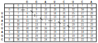
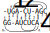

---------------------------------

# Exercise 1

<!--- --------------------------------- -->

::: {.question data-latex=""}

Please have a look at the reformulated recursion of the Jiang algorithm.
In the lecture, some important properties have been omitted for sake of clarity.
In this exercise your task is to explicitly state some of these properties.

:::

<!--- --------------------------------- -->

### 1.1

::: {.question data-latex=""}

What are the base cases for the table entries, how should the tables be initialized?

:::

#### {.tabset}

##### Hide

##### Solution

::: {.answer data-latex=""}

The empty prefix of each M matrix has to be initialized with 0.

:::

#### {-}

<!--- --------------------------------- -->

### 1.2

::: {.question data-latex=""}

What value has to be assigned to entries outside of the tabulated M matrices, for example element $(3,4)$ in the first table of exercise 2?

:::

#### {.tabset}

##### Hide

##### Solution

::: {.answer data-latex=""}

The elements of the M matrices consist of prefix-alignment below 2 arcs.
Any element outside these matrices is invalid and should never be used. Assign $\infty$.

:::

#### {-}

<!--- --------------------------------- -->

### 1.3

::: {.question data-latex=""}

In what situation do we need to evaluate the fourth case of the recursion?

:::

#### {.tabset}

##### Hide

##### Solution

::: {.answer data-latex=""}

The fourth case has to be evaluated only if there exists a pair of arcs that lies completely inside of the evaluated arcs.

:::

#### {-}

<!--- --------------------------------- -->

### 1.4

::: {.question data-latex=""}

Which entry of each M matrix is used for the $F$ matrix?

:::

#### {.tabset}

##### Hide

##### Solution

::: {.answer data-latex=""}

The matrix $F$ stores the final values of all $M$ matrices. The final values of the M-matrices are located at their lower right corners.

:::

#### {-}

<!--- --------------------------------- -->

# Exercise 2

<!--- --------------------------------- -->

::: {.question data-latex=""}

We would like to align the following two structures with the reformulated recursion of the Jiang algorithm:

```{r, include=knitr::is_html_output(), echo=FALSE,  fig.align='center', out.width='40%'}
knitr::include_graphics("assets/figures/exercise-sheet-7/e2-1.svg")
```

The cost for the different operations are $w_d^{\text{end}}=2$, $w_b^{\text{end}}=3$, $w_{am}=6$, $w_d=7$, and $w_m=3$.
The matrices $M^{a_i,a_j}$ and $F$ (with some missing entries) are given as follows:

```{r, include=knitr::is_html_output(), echo=FALSE,  fig.align='center', out.width='75%'}
knitr::include_graphics("assets/figures/exercise-sheet-7/e2-2.svg")
```

:::

<!--- --------------------------------- -->

### 1.1

::: {.question data-latex=""}

Which of the four matrices $M^{a_i}_{a_j}$ on the left corresponds to which pair of arcs $a_i$, $a_j$?

:::

#### {.tabset}

##### Hide

##### Solution

::: {.answer data-latex=""}

a. $M^{a_2,a_3}$
b. $M^{a_2,a_4}$
c. $M^{a_1,a_4}$
d. $M^{a_1,a_3}$

:::

#### {-}

<!--- --------------------------------- -->

### 1.2

::: {.question data-latex=""}

Calculate the missing values (shaded in grey) of the $M^{a_i}_{a_j}$ matrices and also calculate the values of the $F$

:::

#### {.tabset}

##### Hide

##### Solution

::: {.answer data-latex=""}

```{r, include=knitr::is_html_output(), echo=FALSE,  fig.align='center', out.width='75%'}

```

:::

#### {-}

<!--- --------------------------------- -->

# Exercise 3

<!--- --------------------------------- -->

::: {.question data-latex=""}

After having calculated the matrices $M^{a_i}_{a_j}$ we compute the matrix containing the alignment of all prefixes of the entire sequences.
Technically, this is a matrix $M^{a_i}_{a_j}$ for some imaginary base pairs $a_i=(0,9)$ and $a_j=(0,9)$.

This matrix is given as:

```{r, include=knitr::is_html_output(), echo=FALSE,  fig.align='center', out.width='60%'}

```

A part of the final backtrace is also already given by the arrows in the matrix.
Give the missing part of the backtrace and also the alignment corresponding to the backtrace!

:::

#### {.tabset}

##### Hide

##### Solution

::: {.answer data-latex=""}

Traceback:

```{r, include=knitr::is_html_output(), echo=FALSE,  fig.align='center', out.width='60%'}

```

Alignment:

```{r, include=knitr::is_html_output(), echo=FALSE,  fig.align='center', out.width='40%'}

```

:::

#### {-}

<!--- --------------------------------- -->