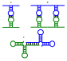
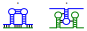
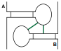
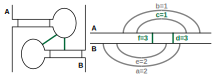

---------------------------------

# Exercise 1 - RNA-RNA interaction

<!--- --------------------------------- -->

::: {.question data-latex=""}

So far, we discussed regulatory mechanisms how ncRNAs can hinder
translation of mRNAs. Develop some hypotheses how ncRNAs can regulate via RNA-RNA
interaction other ncRNAs, which are not translated.

:::

#### {.tabset}

##### Hide

##### Solution

::: {.answer data-latex=""}

i. trigger decay due to binding (similar to to mRNA decay)
ii. block functional binding site (i.e. hinder their functional binding)
iii. trigger refolding via RRI, which blocks or opens functional site of target
iv. $\cdots$

:::

#### {-}

<!--- --------------------------------- -->

# Exercise 2 - Hybridization-focused RRI prediction

<!--- --------------------------------- -->

### 2.1

::: {.question data-latex=""}

When do we stop the traceback of hybridization-focused RRI prediction when using the introduced recursions for energy minimization based on the Nearest-Neighbor model?

:::

#### {.tabset}

##### Hide

##### Solution

::: {.answer data-latex=""}

When we encounter a cell value equal to $eInit$, which represents the left-most RRI base pair.

:::

#### {-}

<!--- --------------------------------- -->

### 2.2

::: {.question data-latex=""}

Is the traceback end from the last question unique? That is, are we sure that the traceback ends at this point? What is the consequence?

:::

#### {.tabset}

##### Hide

##### Solution

::: {.answer data-latex=""}

No, it might be that the overall RRI energy including bulges equals $eInit$, such that two recursion cases provide the same energy.
Thus, the interaction length depends on the case order within the recursion.
If we first test for $eInit$, we will always get the shorter RRI (which is preferred), otherwise the longer one.

:::

#### {-}

<!--- --------------------------------- -->

### 2.3

::: {.question data-latex=""}

For local alignment, we know of so called `mosaic effects`, ie. long local alignment with low score are eventually a combination of some short,
compact subalignments connected by badly scored parts of low sequence similarity.
Since hybridization-focused RRI prediction is technically similar, do you expect similar effects as well or are such cases prevented?

:::

#### {.tabset}

##### Hide

##### Solution

::: {.answer data-latex=""}

Same problem holds for hybrid-only RRI prediction, since we also have a summation-based scoring.
That is, as long as the overall score stays below $eInit$, intermediate bad sub-RRIs can be accumulated to bridge between compact and stable RRI helices.

:::

#### {-}

<!--- --------------------------------- -->

# Exercise 3 - Generalized RRI prediction

<!--- --------------------------------- -->

### 3.1

::: {.question data-latex=""}

Draw at least 3 sketches of RNA-RNA interactions (without sequence details) consisting of intra- *and* inter-molecular base pairing that can be produced via a traceback based on the introduced IRIS recursion.

:::

#### {.tabset}

##### Hide

##### Solution

::: {.answer data-latex=""}

```{r, include=knitr::is_html_output(), echo=FALSE,  fig.align='center', out.width='60%'}

```

:::

#### {-}

<!--- --------------------------------- -->

### 3.2

::: {.question data-latex=""}

Find two RRIs consisting of intra- *and* inter-molecular base pairs (without sequence details) that cannot be decomposed/modeled by the introduced IRIS recursion.

:::

#### {.tabset}

##### Hide

##### Solution

::: {.answer data-latex=""}

```{r, include=knitr::is_html_output(), echo=FALSE,  fig.align='center', out.width='60%'}

```

:::

#### {-}

<!--- --------------------------------- -->

### 3.3

::: {.question data-latex=""}

Draw a Feynman diagram for the following RNA-RNA interaction. Decide whether this RRI can be modeled using the IRIS recursion.
If yes, indicate a possible decomposition order, otherwise highlight the structural parts that make it impossible to decompose.

```{r, include=knitr::is_html_output(), echo=FALSE,  fig.align='center', out.width='40%'}

```

:::

#### {.tabset}

##### Hide

##### Solution

::: {.answer data-latex=""}

```{r, include=knitr::is_html_output(), echo=FALSE,  fig.align='center', out.width='75%'}

```


:::

#### {-}

<!--- --------------------------------- -->

